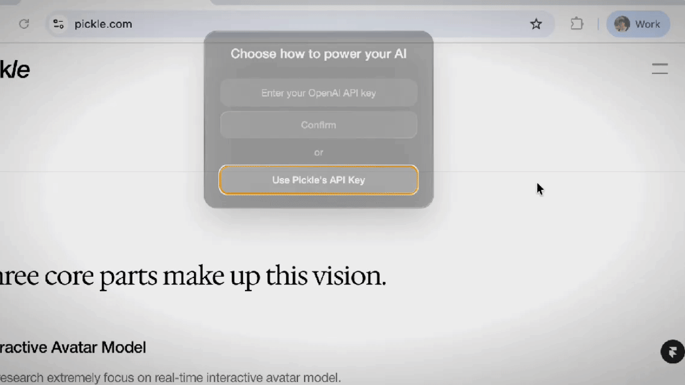

<p align="center">
  <a href="https://pickle.com/glass">
   
  </a>

  <h1 align="center">Glass: AI-Powered Meeting Assistant with Gemini 🧠</h1>

  <p align="center">
    <strong>See. Hear. Understand. Assist.</strong>
  </p>
</p>


<p align="center">
  <a href="https://discord.gg/UCZH5B5Hpd"></a>&ensp;<a href="https://pickle.com"></a>&ensp;<a href="https://x.com/intent/user?screen_name=leinadpark"></a>
</p>

> This project is a fork of [CheatingDaddy](https://github.com/sohzm/cheating-daddy) with modifications and enhancements. Thanks to [Soham](https://x.com/soham_btw) and all the open-source contributors who made this possible!

🤖 **Powered by Google Gemini**—Experience cutting-edge AI with Glass, now integrated with Google's Gemini 2.5 Pro for smarter, more contextual assistance.

💬 **Intelligent Meeting Companion**—Automatically generates meeting summaries, action items, and provides real-time suggestions based on your conversations.

🔒 **Privacy-First**—All processing happens locally on your machine. Your data never leaves your computer without your permission.

🎯 **Context-Aware**—Understands your current tasks, meetings, and work context to provide relevant assistance.

To have fun building with us, join our [Discord](https://discord.gg/UCZH5B5Hpd)!

## Instant Launch

⚡️   Skip the setup—launch instantly with our ready-to-run macOS app.  [[Download Here]](https://www.dropbox.com/scl/fi/znid09apxiwtwvxer6oc9/Glass_latest.dmg?rlkey=gwvvyb3bizkl25frhs4k1zwds&st=37q31b4w&dl=1)

## 🚀 Quick Start

### Prerequisites

- [Node.js](https://nodejs.org/) v20.x or later
- [Python](https://www.python.org/downloads/) 3.8+
- [Git](https://git-scm.com/downloads)

#### Windows Additional Requirements
- [Build Tools for Visual Studio](https://visualstudio.microsoft.com/downloads/)

### Installation

1. **Clone the repository**
   ```bash
   git clone https://github.com/AmiXDme/glass.git
   cd glass
   ```

2. **Install dependencies**
   ```bash
   npm install
   ```

3. **Set up environment variables**
   - Copy `.env.example` to `.env`
   - Add your Gemini API key:
     ```
     GEMINI_API_KEY=your_gemini_api_key_here
     ```

4. **Start the application**
   ```bash
   # Development mode
   npm run dev
   
   # Or build for production
   npm run build
   npm start
   ```

## Highlights

### Ask: get answers based on all your previous screen actions & audio


### Meetings: real-time meeting notes, live summaries, session records


### Powered by Google Gemini



Glass now uses Google's Gemini 2.5 Pro for advanced AI capabilities. Get your API key from [Google AI Studio](https://aistudio.google.com/app/apikey) and add it to your `.env` file.

### Liquid Glass Design (coming soon)


<p>
  for a more detailed guide, please refer to this <a href="https://www.youtube.com/watch?v=qHg3_4bU1Dw">video.</a>
  <i style="color:gray; font-weight:300;">
    we don't waste money on fancy vids; we just code.
  </i>
</p>


## Keyboard Shortcuts

`Ctrl/Cmd + \` : show and hide main window

`Ctrl/Cmd + Enter` : ask AI using all your previous screen and audio

`Ctrl/Cmd + Arrows` : move main window position

## Contributing

We love contributions! Feel free to open issues for bugs or feature requests.

## 🛠 Current Issues & Improvements

| Status | Issue                          | Description                                       |
|--------|--------------------------------|---------------------------------------------------|
| 🚧 WIP     | AEC Improvement                | Transcription is not working occasionally |
| 🚧 WIP     | Code Refactoring               | Refactoring the entire codebase for better maintainability. |
| 🚧 WIP      | Firebase Data Storage Issue    | Session & ask should be saved in firebase for signup users |
| 🚧 WIP      | Login Issue                    | Currently breaking when switching between local and sign-in mode |
| 🚧 WIP      | Liquid Glass                    | Liquid Glass UI for MacOS 26 |
| 🚧 WIP      | Permission Issue           | Mic & system audio & display capture permission sometimes not working|


## About Pickle

**Our mission is to build a living digital clone for everyone.** Glass is part of Step 1—a trusted pipeline that transforms your daily data into a scalable clone. Visit [pickle.com](https://pickle.com) to learn more.

## Star History
[](https://www.star-history.com/#pickle-com/glass&Date)